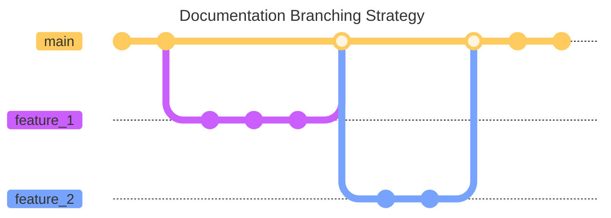

### CDP Information Hub

This repo hosts the code for the [CDP Information Hub](https://cdp-ucsc.github.io/doc), and is intended to be 
the goto resource for the CDP Project. The site is based on the [Docusaurus](https://docusaurus.io/), framework which is an open source project developed in house at Facebook. The Information Hub, is deployed to [Github Pages](https://pages.github.com/) and is publically accessible. 

The project team discussed several documentation solutions including, github wiki, wcms, github pages, before finally deciding that Docusaurus would best meet our needs.  Search the GitHub discussions for details. 

### Contributing

The workflow behind this project is intended to be simplistic and encourgage rapid development and corrections.
Below is the simple feature based workflow that this repository follows.

- create tile to track and describe the objective
- branch main to #_tile_number_descriptive_name
- create documentation on the feature branch
- submit Pull Request(PR) and select a teammate to review
- reviewer merges PR 
- github actions will deploy changes on merge to main



### Workstation Setup

#### Docusaurus Installation Instructions

1. [Download](https://nodejs.org/en/download) and install Node.js

2. Create a site (sample or cdp)
   * Create your own site to test and edit
     ```
     npx create-docusaurus@latest my-website classic
     ```
   * Clone the Github CDP Doc site
  
     This will create a new "doc" directory in your current directory to house the contents of the repository
     ```
     git clone https://github.com/cdp-ucsc/doc.git
     ```
3. Launch the site locally for viewing (sample or cdp)
   * Launch the sample site
     ```
     cd my-website
     npx docusaurus start
     ```
   * Launch the CDP site locally
     ```
     cd \doc\cdp-docs
     npm install [this command only needs to be run once to load dependencies]
     npx docusaurus start
     ```
     The vulnerability warnings encountered when running `npm install` can be safely ignored. 
     
     
     
     These are false positives due to the audit differences of building an app vs generating static content with react([more info](https://github.com/facebook/create-react-app/issues/11174)).
    
    Note: While the site is running locally, any changes in the page source files are reflected immediately on the website
#### Creating Pages and Documents
* Docusaurus uses markdown to create its webpages
  ```
  # Title 1
  ## Title 2
  
  This is a markdown page
  ```
* **/src/pages** contains individual pages hosted at http://localhost:3000/mypage
* **/docs** contains markdown pages that are organized into sections, presented via the sidebar

  See [Create a Document](https://tutorial.docusaurus.io/docs/tutorial-basics/create-a-document)
