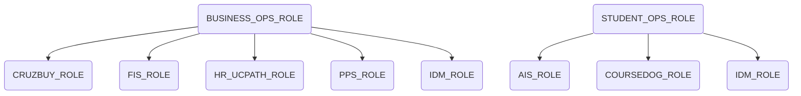
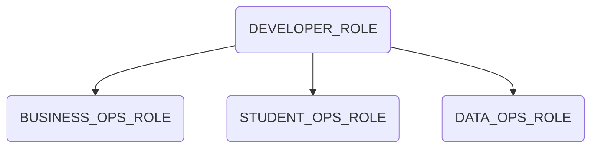
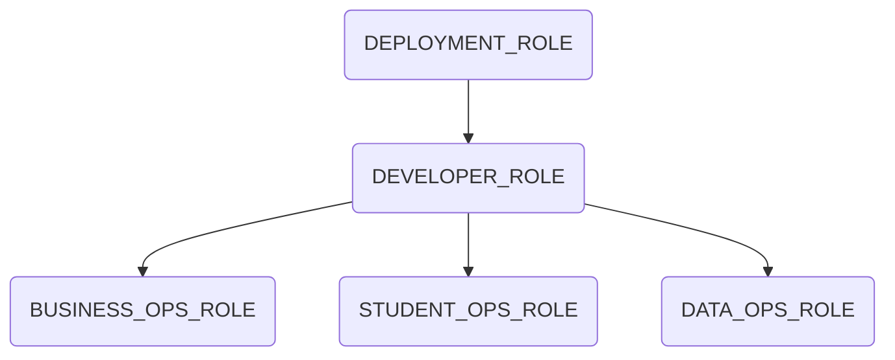

# Snowflake Role based Access Controls (RBAC)

:::caution

This page is a work in progress

:::

This document provides a broad view into the role bases access controls that have been collaboratively developed to provide access for development, analysis and the consumption of information through the Common Data Platform. 

## Source Roles
- Provide direct access to source data.

Source roles are foundational and typically map one-to-one with a source system. As new sources are brought into the platform, a source role is created and assigned.  These roles will be granted the necessary privileges to allow access to the source system's raw data and also provide computing resources in the form of warehouses.

**Utility**

- These roles are typically granted to a secondary Domain Analyst role, where individuals with those roles generally work on more than one data source.
- These roles can, however, be granted to individual analysts when the business need may not extend beyond a single source.
- In some cases, they may remain stand-alone for security purposes and not be granted to secondary roles.
- Stand-alone grants are not intended for development work 

**Source Role**

| Role Name | Role Purpose |
| --- | --- |
| AIS_ROLE | Direct access to raw Campus Solutions/AIS data (CSPRD) |
| COURSEDOG_ROLE | Direct access to raw Curricum Planning data (CourseDog) |
| CRUZBUY_ROLE | Direct access to raw purchasing and procurement data (CruzBuy) |
| FIS_ROLE | Direct access to raw finacial system data (FIS) |
| HR_PATH_ROLE | Direct access to raw hr/payroll  data (UCPath) |
| IDM_ROLE | Direct access to raw identity management data (IDM) |
| PPS_ROLE | Direct access to raw legacy payroll data (PPS) |

**Compute Resources**

A virtual warehouse, often referred to simply as a “warehouse”, is a cluster of compute resources in Snowflake. These resources are generally granted at the source role and usage cascades up the role hierarchy. 

***

## Domain Analyst Roles

- Provide broad access for specific domains.

Domain Analyst Roles are intended for individuals with subject matter expertise who are comfortable working with raw data. These roles inherit access to raw source data from [Source Roles](#source-roles). Typically these roles have access to more than one data source and can be used to transform and model data in development databases.

**Utility**

- These roles are granted to individuals tasked with preparing data for consumption. 
- Allow board access across domain-specific systems. 

**Domain Analyst Role**

| Role Name | Role Purpose |
| --- | --- |
| BUSINESS_OPS_ROLE | Broad access to data from administrative business systems (HR, Finance, Procurement, Identity) |
| STUDENT_OPS_ROLE | Broad across to data from academic business systems (AIS, ALEKS, CourseDog, Identity) |
| DATA_OPS_ROLE | Broad access to data operations sources (System usage, job logs) |

***
## Development Roles
- Broad access across multiple domains.

Development roles provide broad access and are used to build models that blend information from multiple domains. 

**Utility**

- These roles are typically reserved for members of the data team and are primarily used in developing enterprise data models. 
- These roles have the ability to create models and data sets in the development databases.

| Role Name | Role Purpose |
| --- | --- |
| DEVELOPER_ROLE| Broad access to both academic and administrative business systems (HR, Finance, Student, etc)

***
## Infrastructure Roles

- Roles that are used in support of automation and operations typically have broad access and are only available to account administrators.

**Utility**

- Used for daily operations and administration.
- Allow board access across domain-specific systems. 

| Role Name | Role Purpose |
| --- | --- |
| DATA_ENGINEER | Internal to data engineering team |
| DEPLOYMENT_ROLE | Builds production models through automated processes. |
| LOADER_ROLE | Loads data from source systems (Fivetran). |

***
## Consumer Roles
- Roles meant to be integrated with the BI layer and work in conjunction with the tools security features.

**Utility**

- Integrated with the BI layer.
- Access is granted at the data asset / model level at build time.

| Role Name | Role Purpose |
| --- | --- |
| P2_CONSUMER_ROLE | Access to assets with a P2 or P1 data classification |
| P4_CONSUMER_ROLE | Access to assets with a P4 or P3 data classification |

***

## System Defined Roles
These roles are provided by the Snowflake Platform, and will not be discussed in this document, if you would like more information please see the following link. [Snowflake Docs](https://docs.snowflake.com/en/user-guide/security-access-control-overview.html#system-defined-roles)
