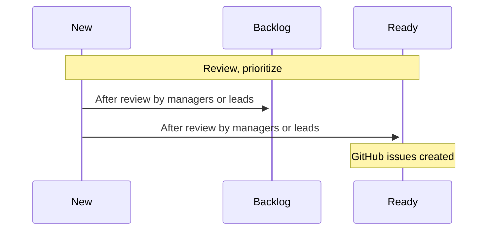
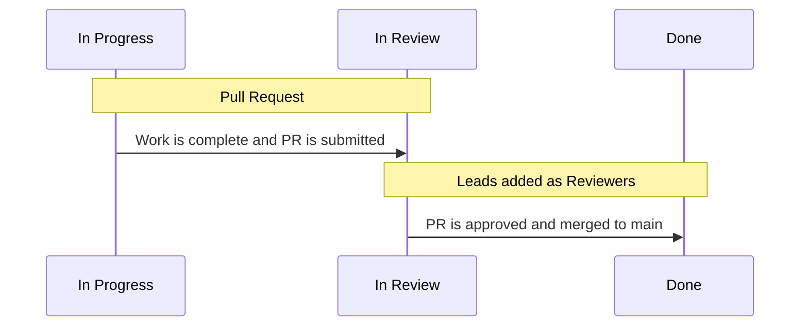

# CDP Workflows

### Workflow Processes

:::caution

This page is a work in progress

:::

The CDP will enhance operational efficiencies through a proactive pursuit of automation and streamlined processes.

### Project Team Members
All are encouraged to submit ideas for consideration. For now this can be done through the GitHub Project interface.  Future integrations with Asana are being evaluated.

### Managers and Leads
Managers and leads will meet on a regular basis to discuss new requests, create, prioritize and assign issues to members of the cdp engineering teams.

----

### Engineering and Business Teams

