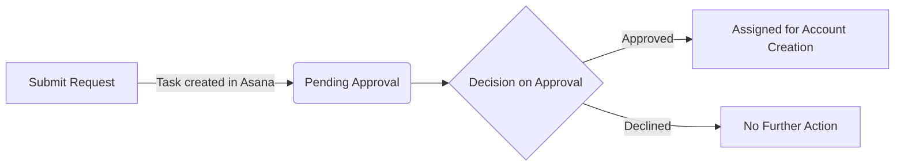

# Access Overview

Certain accounts will need to be setup in various tools that facilitate the modeling and curating of the data. Developers/Analysts will need to request access to the tools that are relevant to their needs. To request access please use the [Request Form](account_request_form).
- Access and permissions and access are granted on a case-by-case basis.
- Note: Most of the technology systems supporting the CDP require an active `dc-vpn` session, if you don't have an account you can request one here: [dc-vpn Request Link](https://slughub.ucsc.edu/com.glideapp.servicecatalog_cat_item_view.do?v=1&sysparm_id=5f76964b134b430014b5b9722244b08f&sysparm_link_parent=055ec563243c1240df6473c878a93689&sysparm_catalog=e0d08b13c3330100c8b837659bba8fb4&sysparm_catalog_view=catalog_default&sysparm_view=catalog_default)

### CDP Account Request / Approval Process

