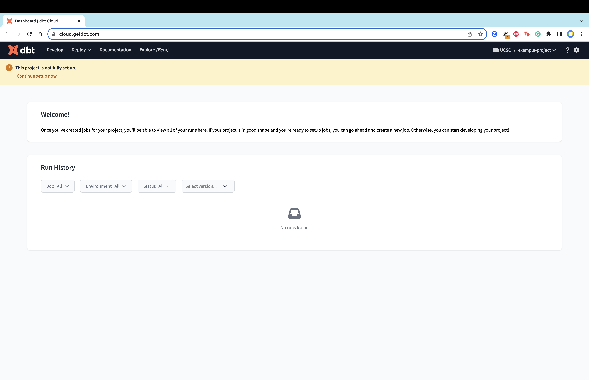
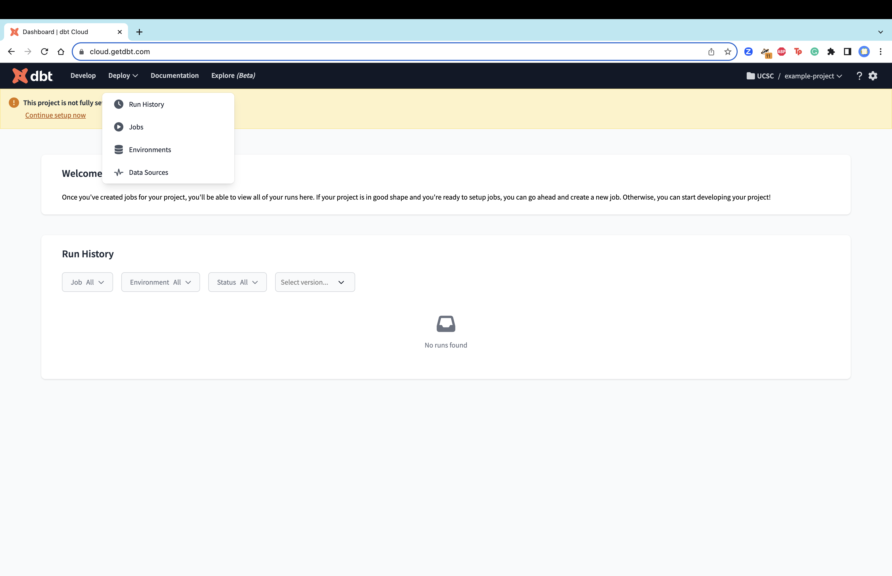
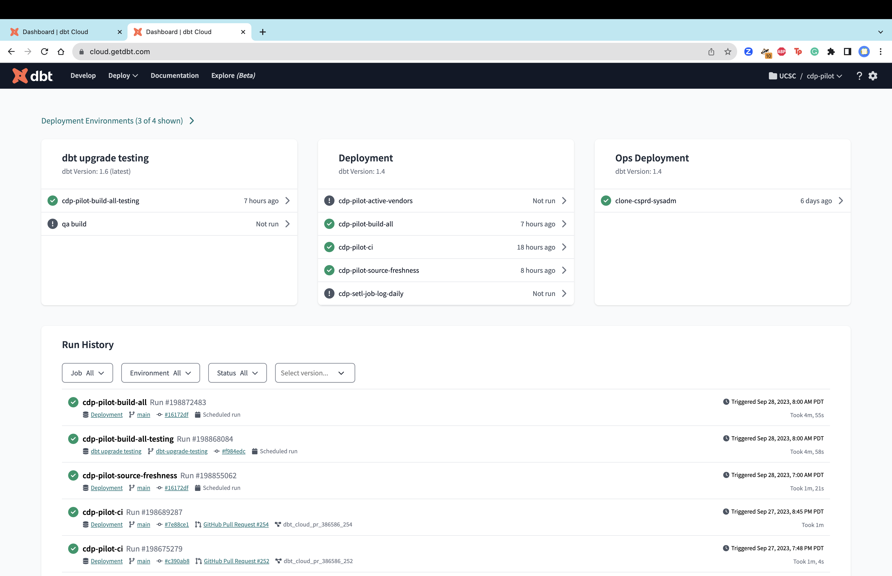
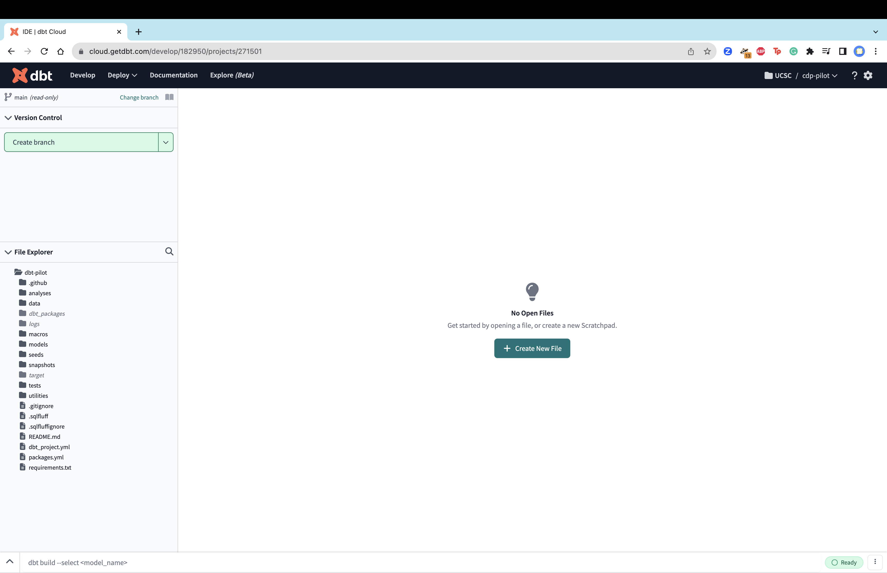
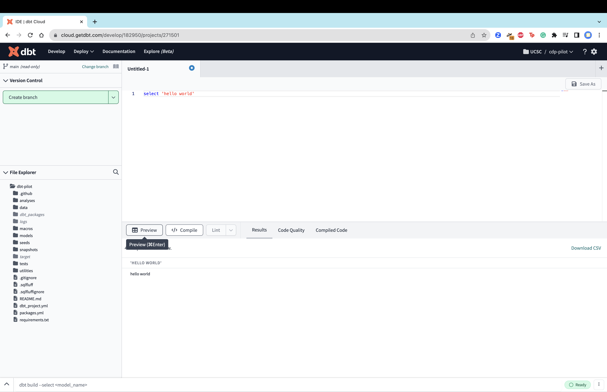

# dbt Cloud Setup

## General Information:
**What is dbt Cloud?** 

dbt Cloud is a feature rich hosted platform that provides a sql editor for dbt project engagement, role based access control (RBCA), model documentation, job scheduling, and capabilities for the deployment of production grade data products. dbt Cloud is the quickest way to come up to speed with the tools and technologies that will be used to model and deliver curated trusted data to information consumers across the campus and beyond. dbt is a data transformation tool that enables data analysts and engineers to transform data from raw source data to curated, trusted models that enable business units to make informed strategic decisions and maximize operational efficiencies.  

This setup documentation will provide an express coverage of dbt Cloud to allow analysts to quickly and efficiently access Cloud for data analysis and development. Please reach out to the core-team for support if you would like assistance with the setup process. 

For those wanting to expand their knowledge on dbt and dbt Cloud specifically, [dbt Lab's official documentation](https://docs.getdbt.com/docs/cloud/about-cloud-setup) is a fantastic place to start.

## Setup and Walk Through:

### 1. Log on to dbt Cloud
UCSC's specific logon site for Cloud can be found in the top right corner of the CDP documentation website. In the top right corner, there is a drop down labeled "Platform Logins" where the link **[dbt Labs](https://cloud.getdbt.com/enterprise-login/ucsc)** will direct users to Cloud. Users will log in with their CruzId and Gold Password (UCSC SSO). If your request for a dbt cloud account has been approved, you will receive and email invitation that will walk you through logging in. 

### 2. Home Page
Users' home page of dbt Cloud should look similar to this where a project name can be seen in the top right corner. In this screenshot, the user has access to the `example-project` project. Users can click on the project name to toggle a list of all projects they have been given access to. As part of the account request, users should have been given access to all of their relevant projects.

If users look at the left corner there are different tabs, the home page is the **Deploy** tab. In **Deploy**, users can find the **Run History**, **Jobs**, **Environments**, and **Data Sources**. The project shown is an example so there are no run histories, jobs, environments, or data sources to be viewed.

An active project home page may look similar to this example.

Not all of the available tabs will be explored in this document.

### 4. Connect to GitHub
Users need to connect their GitHub account to Cloud. Users need to have already been given access to the organization's GitHub.

In the top right corner, click the gear symbol (⛭) and click **Profile Settings**. Scroll down to find the GitHub section under **Linked Accounts**. Click **Link** and complete the process prompted in the redirected GitHub page.

### 3. Connect to Snowflake
Users need to connect their Snowflake account to cloud. Users need to have already been given access to Snowflake.
> The reason why a connection needs to be established with Snowflake from dbt Cloud is because the SQL written in and executed in Cloud is actually sent to and executed by Snowflake. This is a key service of dbt. For addition information: [What, exactly, is dbt?](https://www.getdbt.com/blog/what-exactly-is-dbt). 

In the top right corner, click the gear symbol (⛭) and click **Profile Settings**. On the left panel click **Credentials** under **User Profile**. Click the desired project you are setting up access to. In the right panel that has popped up, click **Edit** and input all of the Snowflake credential information that were provided. Then click **Connect Snowflake Account** and sign in using UCSC's SSO.

Users should repeat this step for all of the projects they will be working on.

### 5. Develop
All of the appropriate connections have been linked and users are now ready to develop.

In the top left corner click the **Develop** tab which will take you to Cloud's IDE.

Click **Create New File** and begin writing and executing SQL queries. Click **Preview** to see a preview of the SQL query.

On the left side, users can see the connection to the project's GitHub repo. From the left panel, users can complete git actions like switching branches, committing changes, and pulling changes. Further, they can directly access models of the branch they are on and run/edit models.

