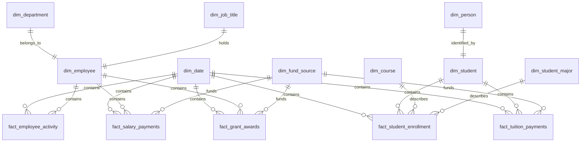
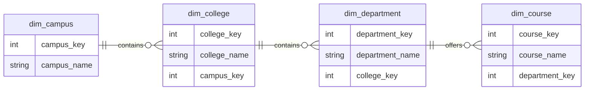

# 📘 Data Modeling Documentation – Hybrid Approach: Star, Snowflake, and Galaxy Schemas

## 📜 Introduction

This documentation outlines a **hybrid approach** to data modeling using **Star**, **Snowflake**, and **Galaxy** schemas. Rather than choosing a single schema style, modern data warehouses often benefit from blending these approaches to optimize for performance, maintainability, and scalability.

---

## 🔺 Schema Overview and Comparison

| Feature / Aspect           | ⭐ Star Schema                                       | ❄️ Snowflake Schema                                      | 🌌 Galaxy Schema                                    |
| -------------------------- | --------------------------------------------------- | -------------------------------------------------------- | --------------------------------------------------- |
| **Structure**              | Central fact table with **denormalized** dimensions | Central fact table with **normalized** dimensions        | Multiple fact tables sharing dimension tables       |
| **Dimension Structure**    | Denormalized                                        | Normalized                                               | Shared (mixed)                                      |
| **Query Performance**      | High                                                | Moderate                                                 | Varies                                              |
| **Storage Efficiency**     | Lower                                               | Higher                                                   | Moderate to High                                    |
| **Maintenance Complexity** | Low                                                 | High                                                     | High                                                |
| **BI Compatibility**       | High                                                | Moderate                                                 | Moderate                                            |
| **Reusability**            | Low                                                 | High                                                     | Very High                                           |
| **Suitable For**           | Simple reporting on a single subject area           | Deep hierarchies, data governance                        | Cross-domain or enterprise-wide analytics           |
| **Primary Use Case**       | Fast reporting, simplicity, BI tool integration     | Data integrity, shared hierarchies, storage optimization | Complex systems with overlapping business processes |

---

## 🧐 Hybrid Modeling Strategy

### When to Use Each Schema

| Scenario                                   | Recommended Schema         |
| ------------------------------------------ | -------------------------- |
| Simple metrics and reporting               | Star                       |
| Deep hierarchies or normalization needed   | Snowflake                  |
| Cross-domain analysis (HR, Sales, Finance) | Galaxy                     |
| Need for shared dimensions                 | Galaxy with Snowflake dims |
| Prototyping and agility                    | Star                       |

### Enterprise-Wide Analytics Example: Public Research University

This hybrid model represents how a public four-year research university can organize cross-domain data to support analytics in HR, Finance, and Student domains.

| Table Name                | Domain(s) Involved | Schema Style | Grain                                        | Notes                                             |
| ------------------------- | ------------------ | ------------ | -------------------------------------------- | ------------------------------------------------- |
| `dim_date`                | All                | Galaxy       | One record per date                          | Shared dimension across all facts                 |
| `dim_employee`            | HR, Finance        | Snowflake    | One record per employee                      | Normalized with links to department and job title |
| `dim_department`          | HR                 | Snowflake    | One record per department                    | Supporting dimension to `dim_employee`            |
| `dim_person`              | HR, Student        | Snowflake    | One record per person                        | Linked to employees and students                  |
| `dim_student`             | Student            | Snowflake    | One record per student                       | Normalized via `dim_person`                       |
| `dim_course`              | Student            | Snowflake    | One record per course                        | Course-specific details                           |
| `dim_student_major`       | Student            | Snowflake    | One record per major                         | Student academic track                            |
| `dim_fund_source`         | Finance            | Snowflake    | One record per funding source                | Used for tuition and grants                       |
| `fact_employee_activity`  | HR                 | Star         | One record per employee per activity per day | Daily actions/events per employee                 |
| `fact_salary_payments`    | HR, Finance        | Galaxy       | One record per employee per pay period       | Joined with employees and fund source             |
| `fact_student_enrollment` | Student            | Star         | One record per student per term per course   | Student registrations per term                    |
| `fact_tuition_payments`   | Student, Finance   | Galaxy       | One record per student payment transaction   | Cross-domain payment records                      |
| `fact_grant_awards`       | Finance            | Snowflake    | One record per grant awarded                 | Funding tied to employees and fund sources        |



This model supports:

* **Unified reporting** across HR, Finance, and Student domains
* **Shared dimensional hierarchies** for consistent filtering and analysis
* **Normalized snowflake structures** where needed for data governance
* **Star schema simplicity** for domain-specific reporting (e.g., student enrollment trends)

---

## 🔑 Denormalized vs Normalized Dimensions

In dimensional modeling, choosing between denormalized and normalized dimensions depends on the trade-offs between performance, complexity, and data integrity. Below is a side-by-side comparison:

| Aspect                     | ⭐ Denormalized Dimensions (Star Schema Style)                                                                 | ❄️ Normalized Dimensions (Snowflake Schema Style)                                                              |
|---------------------------|------------------------------------------------------------------------------------------------------------------|----------------------------------------------------------------------------------------------------------------|
| **Structure**              | All attributes stored in a single wide table                                                                     | Attributes split into multiple related tables                                                                  |
| **Redundancy**             | High – repeated values across rows (e.g., department names)                                                       | Low – data stored once and referenced                                                                           |
| **Query Complexity**       | Low – fewer joins, simpler queries                                                                                | High – requires multiple joins                                                                                  |
| **Performance**            | Optimized for read performance; ideal for BI tools and dashboards                                                 | May experience slower performance due to joins                                                                 |
| **Data Integrity**         | Lower – risk of inconsistency due to duplication                                                                  | Higher – centralized control of shared values                                                                   |
| **Storage Efficiency**     | Lower – duplicate values consume more space                                                                       | Higher – normalized design avoids repetition                                                                    |
| **Ease of Use**            | Easier for analysts and non-technical users to understand                                                         | Requires deeper understanding of relationships and keys                                                         |
| **Maintenance**            | Simple to maintain in early stages; harder to scale                                                               | More effort to set up but easier to manage over time                                                            |
| **Hierarchy Support**      | Limited – flattening hierarchies may lead to data loss or complexity                                              | Strong – supports multi-level hierarchies naturally                                                             |
| **Best Use Cases**         | Simple reporting needs, dashboards, prototyping                                                                  | Enterprise-wide analytics, governed systems, shared data across domains                                        |

### 📌 Summary

- **Use Denormalized Dimensions** when simplicity and speed are priorities, especially in early development or self-service BI environments.
- **Use Normalized Dimensions** when you need strong governance, support for hierarchies, and data reuse across multiple domains.


### Example: Student Dimension from Public University Model

#### ⭐ Star Schema (Denormalized):
**`dim_student`**
| student\_key | full\_name  | gender | date\_of\_birth | major            | enrollment\_status |
| ------------ | ----------- | ------ | --------------- | ---------------- | ------------------ |
| 1001         | Alice Brown | F      | 2003-04-12      | Computer Science | Active             |
| 1002         | Bob Smith   | M      | 2002-09-23      | Biology          | Graduated          |
| 1003         | Charlie Lee | M      | 2000-07-16      | Mathematics      | Active             |
| 1004         | Diane Green | F      | 2001-03-01      | Chemistry        | Active             |
| 1005         | Ella White  | F      | 2003-05-22      | Physics          | Withdrawn          |

#### ❄️ Snowflake Schema (Normalized):

**`dim_student`**

| student\_key | person\_key | major\_key | status\_key |
| ------------ | ----------- | ---------- | ----------- |
| 1001         | 501         | 301        | 1           |
| 1002         | 502         | 302        | 2           |
| 1003         | 503         | 303        | 1           |
| 1004         | 504         | 304        | 1           |
| 1005         | 505         | 305        | 3           |

**`dim_person`**

| person\_key | full\_name  | gender | date\_of\_birth |
| ----------- | ----------- | ------ | --------------- |
| 501         | Alice Brown | F      | 2003-04-12      |
| 502         | Bob Smith   | M      | 2002-09-23      |
| 503         | Charlie Lee | M      | 2000-07-16      |
| 504         | Diane Green | F      | 2001-03-01      |
| 505         | Ella White  | F      | 2003-05-22      |

**`dim_student_major`**

| major\_key | major\_name      |
| ---------- | ---------------- |
| 301        | Computer Science |
| 302        | Biology          |
| 303        | Mathematics      |
| 304        | Chemistry        |
| 305        | Physics          |

**`dim_enrollment_status`**

| status\_key | enrollment\_status |
| ----------- | ------------------ |
| 1           | Active             |
| 2           | Graduated          |
| 3           | Withdrawn          |

This approach shows how a normalized (snowflake) structure enhances **reusability** and **data integrity** while the denormalized (star) model emphasizes **simplicity and performance**.

## 🧾 Fact Tables for Public University Model

### ⭐ Star Schema Fact Table: `fact_student_enrollment`

This version uses **denormalized dimension references** directly for attributes like major, course, and status, which would typically be flattened into the student dimension.

| student_key | course_key | term        | major            | enrollment_status | grade | enrolled_date | completed_date |
|-------------|------------|-------------|------------------|-------------------|-------|----------------|----------------|
| 1001        | 2001       | Fall 2022   | Computer Science | Active            | A     | 2022-08-01     | 2022-12-15     |
| 1002        | 2002       | Spring 2022 | Biology          | Graduated         | B+    | 2022-01-15     | 2022-05-15     |
| 1003        | 2003       | Fall 2022   | Mathematics      | Active            | A-    | 2022-08-01     | 2022-12-15     |
| 1004        | 2004       | Spring 2023 | Chemistry        | Active            | C     | 2023-01-10     | 2023-05-15     |
| 1005        | 2005       | Fall 2023   | Physics          | Withdrawn         | B     | 2023-08-01     | 2023-12-15     |

> In this star schema example, descriptive fields like `major` and `enrollment_status` are included directly in the fact table to simplify querying.

---

### ❄️ Snowflake Schema Fact Table: `fact_student_enrollment`

This version uses **normalized foreign keys** to reference other dimension tables (e.g., student, major, enrollment status). These keys link to smaller, normalized dimension tables for reusability and governance.

| student_key | course_key | term        | major_key | status_key | grade | enrolled_date | completed_date |
|-------------|------------|-------------|-----------|------------|-------|----------------|----------------|
| 1001        | 2001       | Fall 2022   | 301       | 1          | A     | 2022-08-01     | 2022-12-15     |
| 1002        | 2002       | Spring 2022 | 302       | 2          | B+    | 2022-01-15     | 2022-05-15     |
| 1003        | 2003       | Fall 2022   | 303       | 1          | A-    | 2022-08-01     | 2022-12-15     |
| 1004        | 2004       | Spring 2023 | 304       | 1          | C     | 2023-01-10     | 2023-05-15     |
| 1005        | 2005       | Fall 2023   | 305       | 3          | B     | 2023-08-01     | 2023-12-15     |

> This structure is more scalable and consistent, especially for shared and governed dimensions like majors or enrollment statuses.

---

### ✅ Key Difference

- **Star Schema Fact Table** includes descriptive values (e.g., `major`, `status`) inline — simple but redundant.
- **Snowflake Schema Fact Table** uses surrogate keys (e.g., `major_key`, `status_key`) pointing to normalized dimensions — more complex, but promotes data integrity and reuse.


## Benefits of Denormalized (Star) vs Normalized (Snowflake)
### ⭐ Star Schema (Denormalized):
- Faster query performance: As all data is in one table, there is no need for joins.
- Simpler model: Easy for developers to understand and work with.
- Fewer tables: Less complexity in managing the schema.
- Higher storage costs: Data redundancy may increase storage costs.

### ❄️ Snowflake Schema (Normalized):
- More storage-efficient: Data is stored once, reducing redundancy.
- Better data integrity: Less chance of inconsistent data.
- Complex queries: Queries require more joins, which can impact performance.
- Harder to manage: More tables and relationships to maintain.

By selecting a hybrid approach, the Public University Model benefits from **performance** (Star) and **data integrity** (Snowflake) for enterprise-wide analytics.

---

## 🔑 Key Modeling Concepts

* **Surrogate Keys**: Always use surrogate keys for dimension joins
* **Clear Grain**: Define the granularity of fact tables (e.g., daily activity per employee)
* **SCD (Slowly Changing Dimensions)**: Type 2 recommended for history tracking

---

## ✅ Best Practices Summary

* Use **Star Schema** for performance and simplicity
* Normalize dimensions **selectively** (Snowflake) where it reduces duplication
* Use **Galaxy Schema** when multiple facts share dimensions across domains
* Document your grain, keys, and transformation lineage
* Start simple, refactor as your model matures

---

## 📜 Final Recommendation

Use the schemas as tools in a toolkit rather than rigid standards. Mix and match based on:

* Business complexity
* Reporting needs
* Data governance requirements

**A hybrid approach enables flexible, scalable, and performant data models.**

---
# Extra Information

## ❄️ **Snowflake Schema & Deep Hierarchies**

**What it means:**

* A **deep hierarchy** refers to a multi-level dimension structure, where attributes are logically nested.
* For example, in a university setting, a `dim_course` might belong to a `department`, which is part of a `college`, which in turn belongs to a `campus`.

**Snowflake schemas are well-suited for this because:**

* Dimensions are **normalized** into multiple related tables.
* Each level of the hierarchy is stored in its own table with keys linking them, which:

  * Reduces redundancy (e.g., you don’t repeat the college name for every department)
  * Promotes data governance and consistency
  * Allows better **drill-down and roll-up** operations in reporting/OLAP tools

### 🎓 Example: Academic Course Hierarchy

In the **Student** domain of a public research university, courses are part of a structured academic hierarchy. Here's how a snowflake schema would model this:



### 🔄 **Shared Hierarchies (and Snowflake’s Role)**

**What it means:**

* A **shared hierarchy** is when multiple fact tables or subject areas (e.g., Finance and HR) use the **same dimension table or hierarchy**.
* For instance, both payroll and budgeting might reference the same `dim_department` and `dim_employee` structure.

**Snowflake schemas help with this because:**

* Normalization allows you to **centralize shared dimensions** once (e.g., `dim_department`) rather than duplicating them across schemas.
* Updates to the hierarchy (like a department name change) automatically reflect across all referencing models.
* Promotes **data integrity and consistency** across the organization

### ✅ Summary

| Concept                 | Description                                                                  |
| ----------------------- | ---------------------------------------------------------------------------- |
| **Deep Hierarchies**    | Multi-level relationships within a dimension; ideal for normalized structure |
| **Shared Hierarchies**  | One dimension table used across multiple domains or fact tables              |
| **Why Snowflake Helps** | Normalization enables clean, governed, reusable structures for both cases    |

---

## ⚙️ Optimizing Joins in Snowflake Schema Dimensions

Snowflake schemas are powerful for maintaining clean, reusable data structures—but their normalized nature can introduce performance bottlenecks if joins aren't handled efficiently. Below are **warehouse-agnostic** join optimization techniques, followed by **Snowflake-specific recommendations** using blockquotes.

### 1. 🗝️ Use Surrogate Keys for Joins

Surrogate keys are compact, consistent identifiers (usually integers) that simplify joins and improve execution performance.

> **In Snowflake:**  
> Snowflake doesn't enforce primary or foreign key constraints, but defining them helps documentation and query planning. Use surrogate keys even if keys aren't physically constrained.
>
> ```sql
> CREATE TABLE dim_student (
>   student_key INT PRIMARY KEY,
>   ...
> );
> ```

### 2. 📦 Push Down Filters Early

Apply `WHERE` filters as close to the base fact table as possible to limit the data scanned and reduce join overhead.

> **In Snowflake:**  
> Snowflake automatically pushes predicates down, but explicitly placing them early in your query ensures better compile times and leverages partition pruning.
>
> ```sql
> SELECT ...
> FROM fact_student_enrollment f
> JOIN dim_student d ON f.student_key = d.student_key
> WHERE f.term = 'Fall 2023';
> ```

### 3. 🧱 Use Materialized or Flattened Views for Common Joins

Pre-joining normalized dimensions into materialized views or logical views simplifies query logic and boosts performance for repeated patterns.

> **In Snowflake:**  
> Snowflake supports **materialized views**, which store and auto-refresh joined results. Use for slow-changing dimensions or frequently queried hierarchies.
>
> ```sql
> CREATE MATERIALIZED VIEW vw_student_info AS
> SELECT s.student_key, p.full_name, m.major_name
> FROM dim_student s
> JOIN dim_person p ON s.person_key = p.person_key
> JOIN dim_student_major m ON s.major_key = m.major_key;
> ```

### 4. 🧠 Avoid Repeating Joins in Subqueries

Repeated joins across subqueries increase complexity and slow down compile time. Use Common Table Expressions (CTEs) or views to isolate and reuse join logic.

> **In Snowflake:**  
> CTEs help Snowflake's optimizer reuse compiled plans. Avoid duplicating joins inside correlated subqueries.
>
> ```sql
> WITH student_dim AS (
>   SELECT ...
>   FROM dim_student s
>   JOIN dim_person p ON s.person_key = p.person_key
> )
> SELECT ...
> FROM fact_student_enrollment f
> JOIN student_dim sd ON f.student_key = sd.student_key;
> ```

### 5. 🧾 Select Only the Columns You Need

Avoid `SELECT *` when joining multiple dimensions. Reduce data scan size and improve performance by selecting only necessary fields.

> **In Snowflake:**  
> Since Snowflake charges by data scanned, column pruning directly impacts cost and latency.
>
> ```sql
> SELECT f.student_key, f.term, p.full_name
> FROM fact_student_enrollment f
> JOIN dim_person p ON f.student_key = p.person_key;
> ```

### 6. 🗂️ Batch Joins Strategically (Join Ordering)

Join smaller and more selective tables early, and delay joining large dimensions or facts until later.

> **In Snowflake:**  
> Snowflake auto-optimizes join order, but excessive join chains still cause long compile times. Keep filters early and large joins last. Use `EXPLAIN` or Query Profile to validate.
>
> ```sql
> EXPLAIN
> SELECT ...
> FROM fact_tuition_payments t
> JOIN dim_student s ON t.student_key = s.student_key
> WHERE t.term = 'Spring 2024';
> ```

### 7. 🧪 Use Query Profile for Performance Tuning

Visual tools like query plans help you understand join bottlenecks and execution paths.

> **In Snowflake:**  
> Use **Query Profile** in Snowsight. Look for heavy `JOIN`, `SCAN`, or `BROADCAST` operations. These indicate where pruning or filtering can help.

### 8. 📉 Consider Denormalizing Select Dimensions

Where high performance is critical (e.g., dashboards or ad hoc reports), selectively denormalize snowflake dimensions.

> **In Snowflake:**  
> Use `CREATE TABLE AS SELECT` or materialized views to flatten slow-performing hierarchies without changing core models.
>
> ```sql
> CREATE TABLE flat_dim_student AS
> SELECT s.student_key, p.full_name, m.major_name, e.status
> FROM dim_student s
> JOIN dim_person p ON s.person_key = p.person_key
> JOIN dim_student_major m ON s.major_key = m.major_key
> JOIN dim_enrollment_status e ON s.status_key = e.status_key;
> ```

### 9. 🗃️ Use Clustering Keys for Large Tables

Clustering helps Snowflake organize large tables on key columns for faster scans and better join performance.

> **In Snowflake:**  
> Define clustering keys on frequently filtered columns (e.g., `term`, `student_key`, `department_id`). Avoid over-clustering.
>
> ```sql
> CREATE TABLE fact_student_enrollment
> CLUSTER BY (term, student_key);
> ```

By combining **warehouse-agnostic strategies** with **Snowflake-specific tuning**, snowflake schema joins can remain performant even as complexity grows.

---

## 🔍 Further Optimizing Joins where the Key (SK) is null in the Fact Table
Would having a record where the dim SK is null in the dim table optimize the join in the fact table if the fact table's dim SK is null? For example, in fact_a there is a column dim_a_sk that joins fact_a to dim_a. However, not all records in fact_a have a value for dim_a_sk. How can the join between fact_a and dim_a be optimized?

### 💡 Nulls Are Never Equal in SQL

In standard SQL semantics (used by Snowflake and most other systems), **`NULL != NULL`**, which means:

```sql
SELECT * 
FROM fact f
JOIN dim_a d ON f.dim_a_sk = d.dim_a_sk
```

If `f.dim_a_sk IS NULL`, it **won't match** a `d.dim_a_sk IS NULL` row—**because `NULL = NULL` is false** in SQL joins.

> Even if `dim_a` has a row with `dim_a_sk IS NULL`, it **won't be joined** to fact rows with `dim_a_sk IS NULL`.

## ✅ Correct Optimization Strategy

Instead of trying to match on `NULL`, optimize using one of these approaches:

### 1. **Use a Default Surrogate Key (e.g., -1 or 0) for Unknowns**

Assign a placeholder value in your fact table when the dimension is missing:

```sql
-- In fact table
dim_a_sk = -1

-- In dim_a table
dim_a_sk = -1, description = 'Unknown'
```

This allows a clean foreign key relationship and enables indexing, statistics, and joins.

> ✅ **This is the preferred solution in both Star and Snowflake schemas.**

### 2. **Use Left Joins with COALESCE for Display Logic**

If you can't change the data model and must handle nulls:

```sql
SELECT
  f.fact_id,
  COALESCE(d.label, 'Unknown') AS a_label
FROM fact f
LEFT JOIN dim_a d ON f.dim_a_sk = d.dim_a_sk
```

This handles nulls gracefully **for reporting**, but doesn’t optimize joins.

### 3. **Filter Out Nulls Where Joins Are Not Needed**

For certain queries, you may get better performance by excluding nulls:

```sql
WHERE f.dim_a_sk IS NOT NULL
```

This reduces join complexity if those rows are irrelevant.

## 🧠 Snowflake-Specific Insight

> Snowflake's **automatic join optimization and pruning** will not treat null-surrogate rows specially. If you need fast joins with consistent behavior, use surrogate keys like `-1` for unknowns instead of `NULL`.

## ✅ Summary

| Option                   | Recommended? | Notes                                      |
| ------------------------ | ------------ | ------------------------------------------ |
| Row in `dim_a` with NULL | ❌            | Won't match fact rows with NULL keys       |
| Use surrogate like `-1`  | ✅            | Enables proper joins and simplifies logic  |
| Left join with COALESCE  | ⚠️           | OK for display, but not for performance    |
| Filter nulls in queries  | ✅            | Good for focused, high-performance queries |

---

## ✅ Best Practice for Adding Default Surrogate Key Records

### 1. **Insert Default Row in the Dimension Table**

The ideal approach is to **physically insert** a default row into each dimension table during ETL or DDL processes.

```sql
INSERT INTO dim_department (department_sk, department_name)
SELECT -1, 'Unknown'
WHERE NOT EXISTS (
  SELECT 1 FROM dim_department WHERE department_sk = -1
);
```

> 🔁 This should be **automated** as part of your **dimension load process** (ETL/ELT), so it’s always present if needed.

---

## 🔄 Alternative: UNION Statement for Default Row?

### Short Answer: ❌ **Not optimal for joins or performance**

While this technically works:

```sql
SELECT * FROM dim_department
UNION
SELECT -1, 'Unknown'
```

…it has **significant drawbacks**:

| Issue                         | Impact                                                              |
| ----------------------------- | ------------------------------------------------------------------- |
| Not materialized              | The row doesn’t exist physically — not usable for foreign key joins |
| Adds runtime cost             | The `UNION` is evaluated **on every query**                         |
| Not scalable                  | Duplicates logic across hundreds of queries or views                |
| Doesn’t benefit indexing      | Can't use index/statistics effectively                              |
| Potential for inconsistencies | Not guaranteed consistent labels, default values, etc.              |

> ❌ Avoid this pattern unless you're building ad hoc reports or prototypes.

---

## 🧱 Recommended Strategy for Hundreds of Dimensions

### ✅ Automate the Default Record Insertion

Use a **metadata-driven ETL pattern**. For example:

1. Maintain a **list of dimension tables** (e.g., in a control table).
2. Generate SQL dynamically that inserts a default row if missing.
3. Execute during nightly or incremental data loads.

#### Example: Control Table

```sql
CREATE TABLE dimension_defaults (
  dim_table_name STRING,
  surrogate_key_column STRING,
  default_value INT,
  default_label STRING
);
```

#### Example: Dynamic Insertion (Pseudocode)

```sql
FOR EACH row IN dimension_defaults:
    EXECUTE:
    INSERT INTO ${dim_table_name} (${surrogate_key_column}, label)
    SELECT ${default_value}, ${default_label}
    WHERE NOT EXISTS (
        SELECT 1 FROM ${dim_table_name} WHERE ${surrogate_key_column} = ${default_value}
    );
```

> ✅ This scales well across 100+ dimensions and ensures **consistency**.

---

## 📘 Snowflake-Specific Advice

> In **Snowflake**, use `MERGE` or `INSERT ... SELECT ... WHERE NOT EXISTS` during ETL steps to ensure the default record exists.
>
> You can automate this with **Snowflake Tasks + Streams**, or use **dbt** macros to insert default values for dimensions at model run time.
>
> If using **views** over raw tables, ensure your view **materializes or unions** the default row just once, not on every query execution.

---

## ✅ Summary

| Strategy                              | Recommended | Use Case                                                         |
| ------------------------------------- | ----------- | ---------------------------------------------------------------- |
| Physically insert default row         | ✅ Yes       | Best for consistent joins and warehouse performance              |
| UNION with default row in every query | ❌ No        | Avoid — adds overhead, not scalable                              |
| Metadata-driven ETL insertions        | ✅ Yes       | Ideal when managing many dimension tables                        |
| Use `MERGE` or `INSERT ... WHERE`     | ✅ Yes       | Ensures idempotent and safe addition of default row in Snowflake |

---

## ✅ dbt Macro: Insert Default Surrogate Key Record into Dimension Table

This macro reads configs from `dbt_project.yml` and inserts the default record into the dimension table **once** using a dbt `run-operation`. Here's the macro:

```jinja
-- macros/insert_default_surrogate_keys.sql


  

  
    
    
    

    
    

    
    

    
      insert into {{ ref(table_name) }} ({{ column_list }})
      select {{ value_list }}
      where not exists (
        select 1 from {{ ref(table_name) }}
        where {{ sk_column }} = {{ default_sk }}
      );
    

    {{ log("Inserting default surrogate key for " ~ table_name ~ "...", info=True) }}
    {{ run_query(insert_sql) }}
  

```

---

## 🔧 How to Use

### 1. Define in `dbt_project.yml`

```yaml
vars:
  default_surrogate_keys:
    dim_department:
      surrogate_key_column: department_sk
      default_value: -1
      default_values:
        department_name: "Unknown"
    dim_employee:
      surrogate_key_column: employee_sk
      default_value: -1
      default_values:
        first_name: "Unknown"
        last_name: "Unknown"
```

### 2. Run via CLI or dbt Cloud Job

```bash
dbt run-operation insert_default_surrogate_keys
```

This will insert the default row only if it doesn't already exist.

---

## 🧠 Why This Is Better Than `UNION ALL`

| Strategy             | Pros                                       | Cons                                               |
| -------------------- | ------------------------------------------ | -------------------------------------------------- |
| `UNION ALL` in model | Easy to implement, dynamic                 | Adds overhead to every query execution             |
| `INSERT` via macro   | One-time setup, avoids repeated query cost | Must ensure it runs before downstream model builds |

---

This setup keeps your dimension tables clean, performant, and safe from missing foreign key values — all while being dbt-native and Cloud-compatible.
